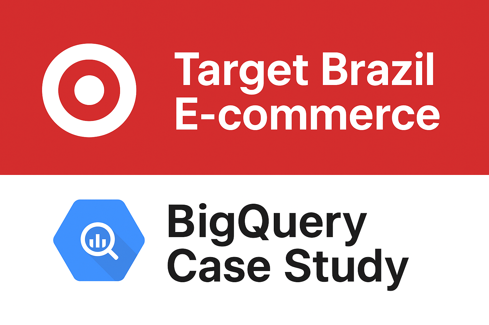

# Target Brazil E-commerce Analysis (2016–2018)

 

---

## 📑 Table of Contents
- [About the Project](#-about-the-project)
- [Dataset](#-dataset)
- [Key Business Questions](#-key-business-questions)
- [Methods & Analysis](#methods-analysis)
- [Files in this Repository](#files-in-this-repository)
- [Tech Stack](#tech-stack)
- [How to Use](#how-to-use)
- [Insights & Recommendations](#insights-recommendations)
- [Contact](#contact)

---

## 📌 About the Project
This repository presents a business case study of **Target’s e-commerce operations in Brazil**, analyzing more than **100,000 orders from 2016 to 2018**.  

All analysis is powered by **Google BigQuery SQL**, enabling scalable, efficient exploration of customer behavior, sales patterns, delivery performance, and payment trends.  

The goal is to uncover **data-driven insights and recommendations** that support revenue growth and operational efficiency.

---

## 📊 Dataset
The analysis is based on publicly available e-commerce data provided across **8 CSV files**:  

- `customers.csv` – Customer information  
- `geolocation.csv` – Customer locations  
- `order_items.csv` – Products in each order  
- `payments.csv` – Payment transactions  
- `reviews.csv` – Customer reviews  
- `orders.csv` – Order timelines  
- `products.csv` – Product catalog  
- `sellers.csv` – Seller details  

---

## ❓ Key Business Questions
The project addresses critical e-commerce questions, such as:  
- 📈 Is there a growing trend in Brazilian e-commerce during 2016–2018?  
- 🗓️ Are there seasonal peaks in purchasing behavior?  
- ⏰ At what times of day do customers prefer to shop?  
- 🌎 How are customers and orders distributed across states and cities?  
- 💰 What is the economic impact of sales, payments, and freight costs?  
- 🚚 How efficient is delivery compared to estimated timelines?  
- 💳 How do payment types and installment preferences affect transactions?  

---

## 🔎 Methods & Analysis
Using **Google BigQuery**, SQL queries were designed to answer the above business questions. Key analyses include:  

- **E-commerce Trends** – Monthly and yearly growth of orders.  
- **Customer Behavior** – Distribution across states, shopping time preferences.  
- **Economic Impact** – Total sales, payment values, freight costs, and YoY growth.  
- **Delivery Performance** – Time-to-delivery vs. estimated delivery dates.  
- **Payment Analysis** – Order counts by payment type and installment count.  

---

## 📂 Files in this Repository
This repository is organized as follows:  

- 📜 **[queries.sql](queries.sql)** – Contains all SQL queries used in the analysis.  
- 📕 **[Business_Case_Report.pdf](Business_Case_Report.pdf)** – Detailed PDF report with:  
  - Business case questions  
  - SQL queries  
  - Query results (in image format)  
  - Short insights for each question  
- 📑 **[Summary_Insights.md](Summary_Insights.md)** – In-depth insights and business recommendations.  

---

## 🛠 Tech Stack
- **Google BigQuery** – SQL queries and large-scale data analysis  

---

## 💡 Insights & Recommendations
The results of this project provide actionable insights into:  
- Improving delivery efficiency.  
- Optimizing freight cost strategies.  
- Leveraging seasonal peaks for promotions.  
- Enhancing customer retention through payment flexibility.  

📕 For detailed recommendations, see:  
- [`Business_Case_Report`](Business_Case_Report.pdf)  
- [`Summary_Insights`](Summary_Insights.pdf)  

---

## 📬 Contact
For questions or collaboration opportunities, feel free to connect with me:  
- **LinkedIn:** [Your Profile](#)  
- **Email:** your.email@example.com  
